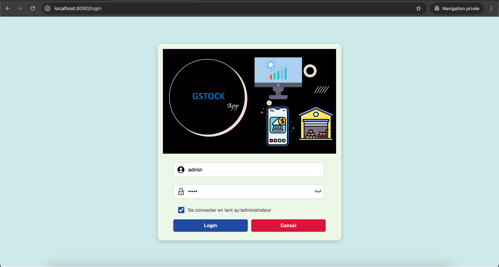
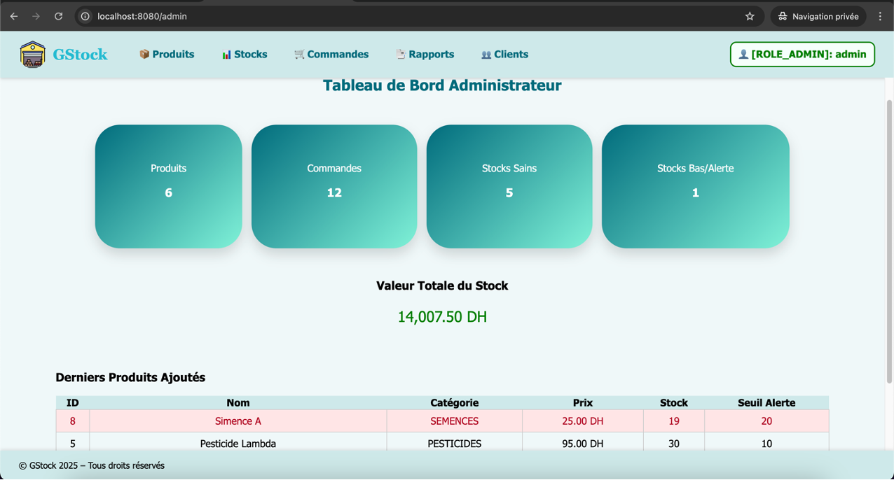
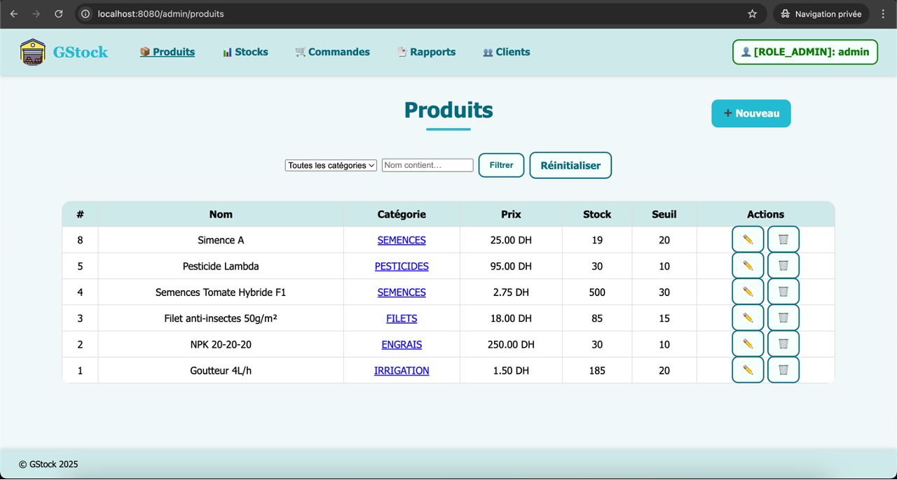
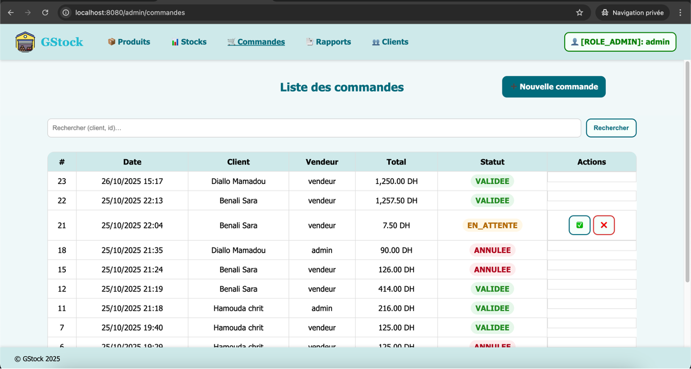

# GStock — Application web de gestion des stocks et commandes d’agrofournitures


Application web **Spring Boot + Thymeleaf** pour gérer produits, clients, commandes et stocks, avec rôles **Admin** et **Vendeur**, authentification sécurisée et **déploiement cloud (PostgreSQL/Neon + Render)**.

🌐 **Démo live :** [https://gstock-2j0w.onrender.com/login](https://gstock-2j0w.onrender.com/login)

---

## 📌 Sommaire

1. [Fonctionnalités](#-fonctionnalités)
2. [Stack technique](#-stack-technique)
3. [Architecture & modèles](#-architecture--modèles)
4. [Démarrage rapide](#-démarrage-rapide)
    - [Prérequis](#-prérequis)
    - [Configuration locale](#2-configuration-locale-profil-dev)
    - [Lancer l’app en local](#3-lancer-lapp-en-local--avec-maven-wrapper-)
    - [Comptes de démonstration](#-comptes-de-démonstration)
5. [Déploiement sur Render](#-déploiement-sur-render)
6. [Aperçu](#-aperçu-screenshots)
7. [Auteurs](#-auteurs)
8. [Licence](#-licence)

---

## ✅ Fonctionnalités

🔐 Authentification & rôles via Spring Security (**ADMIN, VENDEUR**)  
📦 **Produits** : CRUD + catégories + recherche  
👥 **Clients** : CRUD complet  
🧾 **Commandes** : brouillon → validée → livrée + lignes de commande  
📊 **Stocks** : décrémentation auto + vérification stock bas  
📈 Rapports simples (DTO de reporting)  
👤 Profil utilisateur (mise à jour infos basiques)  
🖥️ UI Thymeleaf responsive (`src/main/resources/templates`)

---

## 🛠️ Stack technique

| Technologie | Version |
|-------------|---------|
| Java | 17+ |
| Spring Boot | 3.5.x |
| Spring MVC / Thymeleaf / Security 6 | ✅ |
| JPA (Hibernate) + HikariCP | ✅ |
| MySQL 8 (dev) | ✅ |
| PostgreSQL (Neon, prod) | ✅ |
| Flyway (migrations, optionnel) | ✅ |
| Docker + Render (déploiement) | ✅ |

---

## 🏗️ Architecture & modèles

```
ma.gstock
├─ config/ (sécurité, seed/dev…)
├─ controllers/ (Admin, Vendeur, Auth, Commande, Profil…)
├─ dto/commande/ (DTOs: création, état, reporting…)
├─ entities/ (Client, Produit, Commande, LigneCommande, Utilisateur)
│ └─ enums/ (CategorieProduit, Role, StatutCommande)
├─ exceptions/ ( StockInsuffisantException…)
├─ repositories/ (Spring Data JPA)
├─ services/ (CommandeService, StockService…)
└─ web/ (ApiExceptionHandler…)
```

### Modèle de données (simplifié)

| Entité | Champs principaux                             |
|--------|-----------------------------------------------|
| Produit | id, nom, categorie, prix, stock               |
| Client | id, nom, email                                |
| Commande | id, date, client, statut , total              |
| LigneCommande | id, commande, produit, quantite, prixUnitaire |
| Utilisateur | id, username, password, role                  |

---

## 🚀 Démarrage rapide

### 1️⃣ Prérequis

✅ Java **17+**  
✅ Maven (**wrapper inclus : `./mvnw`**)  
✅ MySQL 8 local ou Docker  
✅ (Optionnel) Docker Desktop


### 2️⃣ Configuration locale (profil `dev`)

Créer : `src/main/resources/application-dev.properties`

```properties
# --- MySQL local ---
spring.datasource.url=jdbc:mysql://localhost:3306/gestion_stock?useSSL=false&allowPublicKeyRetrieval=true&serverTimezone=UTC
spring.datasource.username=xxxx
spring.datasource.password=xxxx
spring.datasource.driver-class-name=com.mysql.cj.jdbc.Driver

# --- JPA/Hibernate ---
spring.jpa.hibernate.ddl-auto=update
spring.jpa.database-platform=org.hibernate.dialect.MySQL8Dialect
spring.jpa.show-sql=true
spring.jpa.properties.hibernate.format_sql=true

# Optionnel en local si tu n'utilises pas Flyway :
spring.flyway.enabled=false

# Thymeleaf non-caché en dev
spring.thymeleaf.cache=false

```


### 3️⃣ Lancer l’app en local ( Avec Maven wrapper )

```
./mvnw spring-boot:run -Dspring-boot.run.profiles=dev
```

ou :

```
export SPRING_PROFILES_ACTIVE=dev
./mvnw spring-boot:run
```

#### ➡️ App dispo sur : http://localhost:8080/


### 🔑 Comptes de démonstration

| Rôle | Username | Mot de passe |
|------|----------|---------|
| Admin | admin | admin |
| Vendeur | vendeur | vendeur |


--- 

 ## ☁️ Déploiement sur Render 

#### ➡️ lien Render live : https://gstock-2j0w.onrender.com/login

---

## 🎥 Aperçu (screenshots)

| Login | Dashboard Admin         | Produits | Commandes               |
|-------|-------------------------|----------|-------------------------|
|  |  |  |  |

---

## 👥 Auteurs

- **Anas KRIR** — Développeur Back-End / Gestion du projet
- **Adam EL YOURI** — Développeur Front-End / UI & intégration

---

 ## 📄 Licence

Projet sous licence MIT. <br/>
✅ Libre d’utiliser, modifier, distribuer.

© 2025 — KRIR Anas & EL YOURI Adam

---


